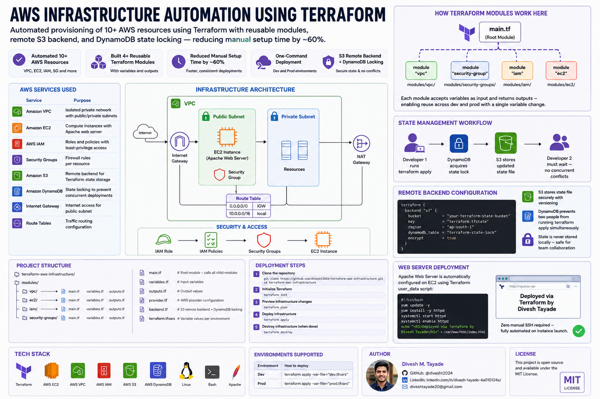

# ⚙️ AWS Infrastructure Automation using Terraform

Automated provisioning of 10+ AWS resources using Terraform with reusable modules, remote S3 backend, and DynamoDB state locking — reducing manual setup time by approximately 60%.

This project demonstrates production-grade Infrastructure as Code (IaC) principles enabling consistent, one-command deployment across dev and prod environments.

---
<p align="center">
  
</p>

---

## ☁️ AWS Services Used

| Service | Purpose |
|---------|---------|
| Amazon VPC | Isolated private network with public/private subnets |
| Amazon EC2 | Compute instances with Apache web server |
| AWS IAM | Roles and policies with least-privilege access |
| Security Groups | Firewall rules per resource |
| Amazon S3 | Remote backend for Terraform state storage |
| Amazon DynamoDB | State locking to prevent concurrent deployments |
| Internet Gateway | Internet access for public subnet |
| Route Tables | Traffic routing configuration |

---
## 🏆 Key Achievements

- ✅ Automated 10+ AWS resources — VPC, EC2, IAM roles, Security Groups and more
- ✅ Built 4+ reusable Terraform modules with variables and outputs
- ✅ Reduced manual infrastructure setup time by approximately 60%
- ✅ Configured S3 remote backend with DynamoDB state locking — preventing concurrent state conflicts
- ✅ One-command deployment across dev and prod environments
## 🛠️ Tech Stack

`Terraform` `AWS EC2` `AWS VPC` `AWS IAM` `AWS S3` `AWS DynamoDB` `Linux` `Bash` `Apache`

---

## 📂 Project Structure

```
terraform-aws-infrastructure/
│
├── modules/
│   ├── vpc/
│   │   ├── main.tf
│   │   ├── variables.tf
│   │   └── outputs.tf
│   ├── ec2/
│   │   ├── main.tf
│   │   ├── variables.tf
│   │   └── outputs.tf
│   ├── iam/
│   │   ├── main.tf
│   │   ├── variables.tf
│   │   └── outputs.tf
│   └── security-groups/
│       ├── main.tf
│       ├── variables.tf
│       └── outputs.tf
│
├── main.tf            # Root module — calls all child modules
├── variables.tf       # Input variables
├── outputs.tf         # Output values
├── provider.tf        # AWS provider configuration
├── backend.tf         # S3 remote backend + DynamoDB locking
└── terraform.tfvars   # Variable values per environment
```

---

## ⚙️ Infrastructure Components

### 🌐 Networking
- Custom VPC with public subnet
- Internet Gateway for internet access
- Route Tables and Route Table Associations
- NAT Gateway for private subnet outbound access

### 💻 Compute
- EC2 instance provisioned via Terraform module
- Apache web server configured via `user_data` script
- Automated server setup — zero manual SSH required

### 🔐 Security
- IAM Roles with least-privilege policies
- Security Groups with controlled inbound/outbound rules
- No hardcoded credentials — all values via variables

### 🗄️ State Management
```
Developer 1 runs terraform apply
        ↓
DynamoDB acquires state lock
        ↓
S3 stores updated state file
        ↓
Developer 2 must wait — no concurrent conflicts
```

---

## 🔄 How Terraform Modules Work Here

```
main.tf (Root)
    │
    ├── module "vpc"            → modules/vpc/
    ├── module "security-group" → modules/security-groups/
    ├── module "iam"            → modules/iam/
    └── module "ec2"            → modules/ec2/
```

Each module accepts variables as input and returns outputs — enabling reuse across dev and prod with a single variable change.

---

## 🚀 Deployment Steps

### Prerequisites
- AWS CLI configured (`aws configure`)
- Terraform installed (v1.0+)
- S3 bucket and DynamoDB table created for remote backend

### Step 1 — Clone the repository
```bash
git clone https://github.com/divesht2024/terraform-aws-infrastructure.git
cd terraform-aws-infrastructure
```

### Step 2 — Initialize Terraform
```bash
terraform init
```

### Step 3 — Preview infrastructure changes
```bash
terraform plan
```

### Step 4 — Deploy infrastructure
```bash
terraform apply
```

### Step 5 — Destroy infrastructure (when done)
```bash
terraform destroy
```

---

## 🗄️ Remote Backend Configuration

```hcl
# backend.tf
terraform {
  backend "s3" {
    bucket         = "your-terraform-state-bucket"
    key            = "terraform.tfstate"
    region         = "ap-south-1"
    dynamodb_table = "terraform-state-lock"
    encrypt        = true
  }
}
```

**Why this matters:**
- S3 stores state file securely with versioning
- DynamoDB prevents two people from running `terraform apply` simultaneously
- State is never stored locally — safe for team collaboration

---

## 🌐 Web Server Deployment

Apache Web Server is automatically configured on EC2 using Terraform `user_data`:

```bash
#!/bin/bash
yum update -y
yum install -y httpd
systemctl start httpd
systemctl enable httpd
echo "<h1>Deployed via Terraform by Divesh Tayade</h1>" > /var/www/html/index.html
```

Zero manual SSH required — fully automated on instance launch.

---

## 📊 Environments Supported

| Environment | How to deploy |
|-------------|--------------|
| Dev | `terraform apply -var-file="dev.tfvars"` |
| Prod | `terraform apply -var-file="prod.tfvars"` |

Same modules, different variable files — consistent infrastructure across environments.

---

## 👨‍💻 Author

**Divesh M. Tayade**
- 🐙 GitHub: [@divesht2024](https://github.com/divesht2024)
- 💼 LinkedIn: [linkedin.com/in/divesh-tayade](https://www.linkedin.com/in/divesh-tayade-4a010124a/)
- 📧 diveshtayade20@gmail.com

---

## 📄 License

This project is open source and available under the [MIT License](LICENSE).
